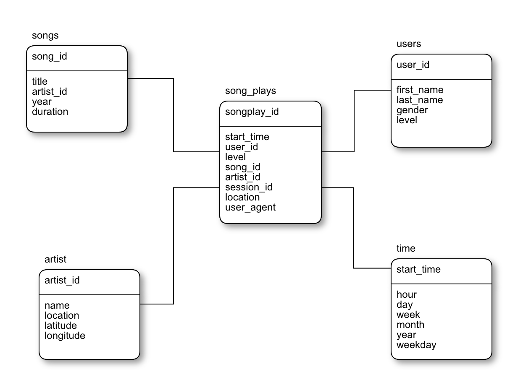

# Resume Project 1

## Data Modeling with Postgres

### Introduction
A startup called Sparkify wants to analyze the data they've been collecting on songs and user activity on their new music streaming app. The analytics team is particularly interested in understanding what songs users are listening to. Currently, they don't have an easy way to query their data, which resides in a directory of JSON logs on user activity on the app, as well as a directory with JSON metadata on the songs in their app.

They'd like a data engineer to create a Postgres database with tables designed to optimize queries on song play analysis, and bring you on the project. Your role is to create a database schema and ETL pipeline for this analysis. You'll be able to test your database and ETL pipeline by running queries given to you by the analytics team from Sparkify and compare your results with their expected results.
#

## Project Description
In this project, you'll apply what you've learned on data modeling with Postgres and build an ETL pipeline using Python. To complete the project, you will need to define fact and dimension tables for a star schema for a particular analytic focus, and write an ETL pipeline that transfers data from files in two local directories into these tables in Postgres using Python and SQL.

#

## Datasets

### Song Dataset
The first dataset is a subset of real data from the [Million Song Dataset](https://labrosa.ee.columbia.edu/millionsong/). Each file is in JSON format and contains metadata about a song and the artist of that song. The files are partitioned by the first three letters of each song's track ID. For example, here are filepaths to two files in this dataset:

`song_data/A/B/C/TRABCEI128F424C983.json`
`song_data/A/A/B/TRAABJL12903CDCF1A.json`

### Log Dataset

The second dataset consists of log files in JSON format generated by this [event simulator](https://github.com/Interana/eventsim) based on the songs in the dataset above. These simulate app activity logs from a music streaming app based on specified configurations.

The log files in the dataset you'll be working with are partitioned by year and month. For example, here are filepaths to two files in this dataset.

`log_data/2018/11/2018-11-12-events.json`
`log_data/2018/11/2018-11-13-events.json`

#

#### Star Schema
The star schema consists of one or more fact tables (in this case one, called `song_plays`) referencing any number of dimension tables (in this case four called `song_id`, `users`, `artist` and `time`). In this project using the song and log datasets, you'll need to create a star schema optimized for queries on song play analysis.

In details:

**Fact Table:**

**songplays** : (records in log data associated with song plays i.e. records with page `NextSong`) *songplay_id*, *start_time*, *user_id*, *level*, *song_id*, *artist_id*, *session_id*, *location*, *user_agent*

**Dimension Tables:**

**users**: (users in the app) *user_id*, *first_name*, *last_name*, *gender*, *level*

**songs**: (songs in music database) *song_id*, *title*, *artist_id*, *year*, *duration*

**artists**: (artists in music database) *artist_id*, *name*, *location*, *lattitude*, *longitude*

**time**: (timestamps of records in songplays broken down into specific units)
*start_time*, *hour*, *day*, *week*, *month*, *year*, *weekday*

**Image Schema:**

## Project Steps

- Write CREATE statements in `sql_queries.py` to create each table.
- Write DROP statements in `sql_queries.py` to drop each table if it exists.
- Run `create_tables.py` to create your database and tables.
- Run `test.ipynb` to confirm the creation of your tables with the correct columns. Make sure to click "Restart kernel" to close the connection to the database after running this notebook.
- Build ETL Processes: Follow the steps in `etl.ipynb` file for complete the notebook. 
- Build ETL Pipeline

